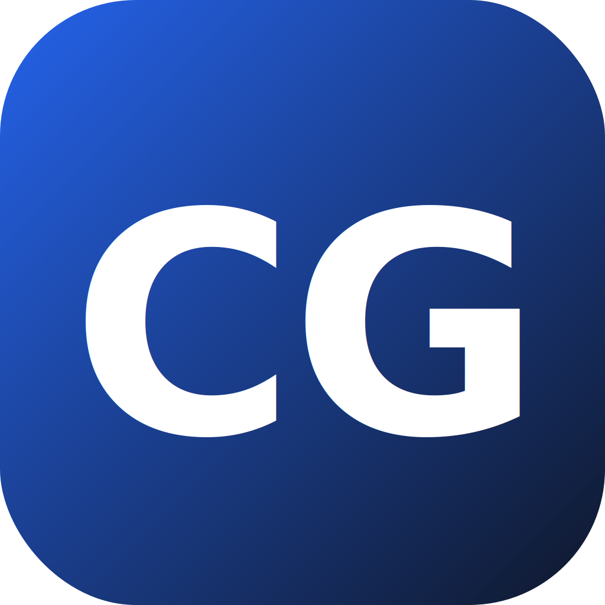
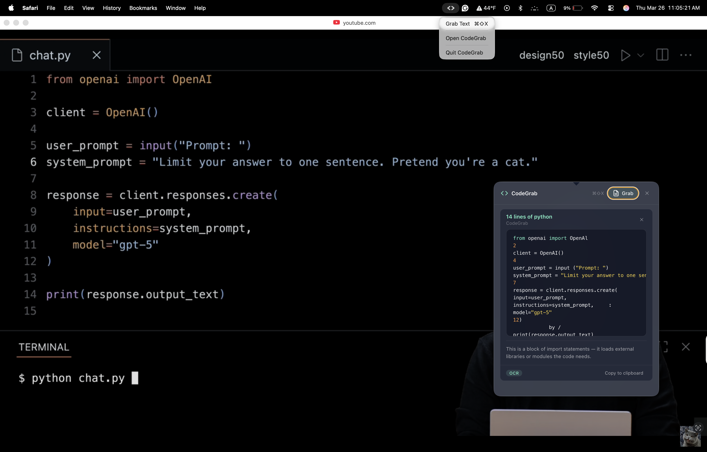

<p align="center">
  
</p>

<h1 align="center">CodeGrab</h1>

<p align="center">
  <strong>Grab text from any screen, code, recipes, notes, anything.</strong><br>
  A tiny macOS menu bar app that reads your screen and copies what it sees.
</p>

<p align="center">
  <a href="../../releases/latest">
    
  </a>
</p>

---

## What it does

CodeGrab sits in your macOS menu bar. Press **Cmd+Shift+X** (or click the tray icon) and it instantly reads whatever is on your screen: a YouTube tutorial, a recipe video, a locked PDF, a screenshot; extracts the text, cleans it up, and copies it to your clipboard.

**Use cases:**
- Grab code from video tutorials without pausing and retyping
- Copy recipes from cooking videos or Instagram reels
- Extract text from screenshots or locked PDFs
- Pull notes from online lectures or slides
- Capture anything your screen shows that you can't select

## How to install

1. **[Download the latest DMG](../../releases/latest)**
2. Open it, drag **CodeGrab** to Applications
3. Launch it; the `</>` icon appears in your menu bar
4. Grant Screen Recording permission when prompted

## How it works
<p align="center">
  
</p>

That's it. No account, no API key, everything runs locally.

| Step | What happens |
|------|-------------|
| **1. Hotkey** | Press **Cmd+Shift+X** anywhere |
| **2. Smart extraction** | Tries DOM scraping, Accessibility API, then OCR; picks the best result |
| **3. Cleanup** | Strips line numbers, fixes OCR artifacts, identifies the language |
| **4. Clipboard** | Cleaned text is auto-copied. A glass popover shows the result. |

### Extraction layers

1. **Browser DOM** — AppleScript reads `<code>` and `<pre>` elements from Chrome, Arc, Safari
2. **Accessibility API** — Reads focused text from VS Code, Terminal, and other apps
3. **OCR (fallback)** — Screenshots your screen and runs Tesseract.js locally

## Build from source

```bash
git clone https://github.com/youssefbouhaik0/CodeGrab.git
cd CodeGrab
npm install
npm run dev
```


## Requirements

- macOS 12+ (Monterey or later)
- Screen Recording permission
- Accessibility permission (for text extraction from apps)
